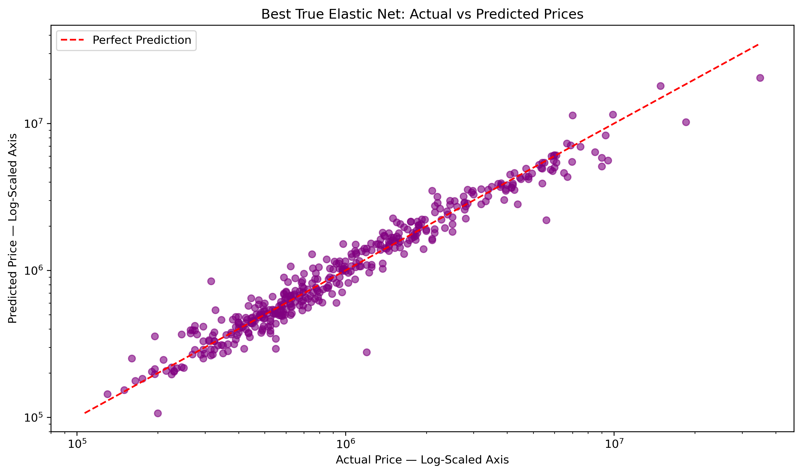
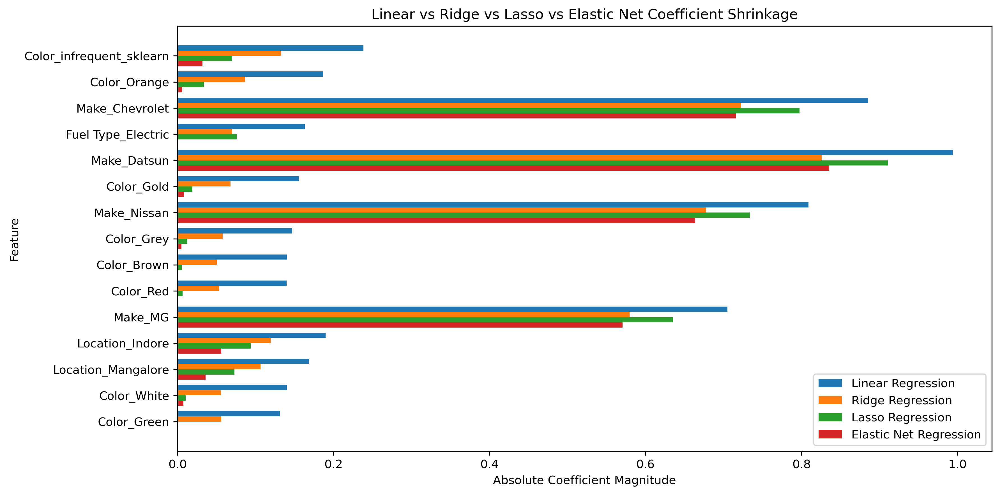
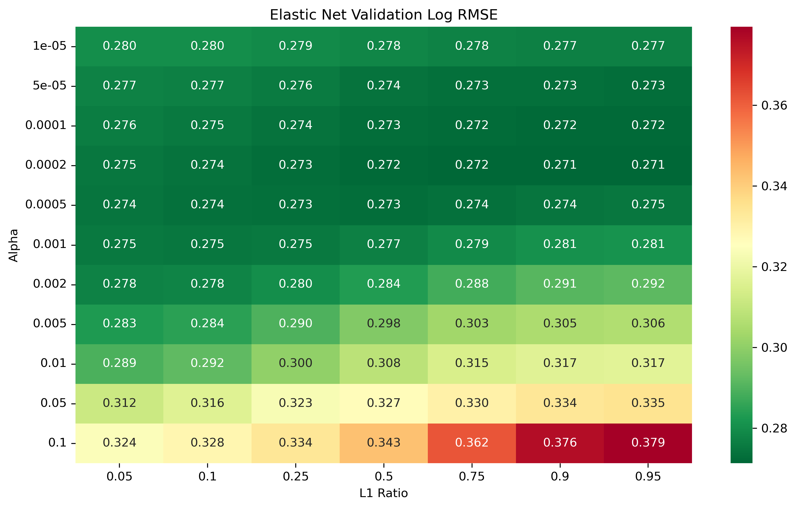

# Linear and Regularized Regression for Used-Car Price Prediction

A research-oriented machine learning project comparing Linear, Ridge, Lasso, and Elastic Net Regression for used-car price prediction.

The project demonstrates leakage-safe preprocessing, log-target modelling, cross-validation, hyperparameter tuning, multicollinearity analysis, coefficient shrinkage, feature selection, stability analysis, residual diagnostics, and reproducible result generation.

## Project Objectives

- Build a complete regression workflow using real-world tabular data.
- Compare unregularized and regularized linear models fairly.
- Prevent data leakage through pipeline-based preprocessing.
- Study multicollinearity and coefficient stability.
- Evaluate prediction accuracy using MAE, RMSE, and R².
- Produce a GitHub portfolio project suitable for research preparation and AI/ML roles.

## Dataset

| Item | Description |
|---|---|
| Dataset | CarDekho Used-Car Dataset |
| Source | [Kaggle Vehicle Dataset from CarDekho](https://www.kaggle.com/datasets/nehalbirla/vehicle-dataset-from-cardekho) |
| Observations | 2,059 |
| Raw columns | 20 |
| Target | `Price` |
| Raw input features | 19 |
| Local file | `data/raw/car_price_data.csv` |

The dataset represents used-car listings and includes vehicle identity, age, mileage, technical specifications, location, ownership, transmission, fuel type, and physical dimensions.

Detailed source, license, integrity, and limitation information is available in [`data/README.md`](data/README.md).

## Data Preparation

The same leakage-safe workflow was used for all comparable models:

- 80% training and 20% test split
- `random_state=42`
- Target separated before preprocessing
- Feature engineering performed after splitting
- `Vehicle_Age = 2022 - Year`
- Technical values extracted from text columns:
  - `Engine_CC`
  - `Power_BHP`
  - `Power_RPM`
  - `Torque_NM`
  - `Torque_RPM_Clean`
- Median imputation with missing-value indicators
- Numerical feature standardization
- Missing categorical values replaced with `Missing`
- Rare-category grouping using `min_frequency=5`
- One-hot encoding with `handle_unknown="ignore"` and `drop="first"`
- Final processed feature count: 160

The preprocessing pipeline was fitted only on training data. The test set was not used for hyperparameter selection.

## Why Log-Transform Price?

The original training Price distribution was strongly right-skewed.

- Original Price skewness: approximately 4.45
- Log Price skewness: approximately 0.46

Using `log1p(Price)` improved distribution symmetry, prevented negative final predictions, reduced heteroscedasticity, and substantially improved Linear Regression performance.

## Model Results

All metrics below were calculated on the same independent test set and on the original Price scale.

| Model | Alpha | L1 Ratio | MAE | RMSE | R² | Zero Coefficients |
|---|---:|---:|---:|---:|---:|---:|
| Log-Target Linear Regression | — | — | 302,345 | 996,774 | 0.8578 | 0 |
| Basic Ridge Regression | 1.0 | — | 301,740 | **990,955** | **0.8594** | 0 |
| CV-Selected Ridge Regression | 0.5 | — | 301,183 | 999,199 | 0.8571 | 0 |
| CV-Selected Lasso Regression | 0.0001 | 1.0 | 298,436 | 1,003,504 | 0.8559 | 25 |
| Best True Elastic Net Regression | 0.0002 | 0.99 | **297,854** | 998,411 | 0.8573 | 36 |

Basic Ridge is included as an observed benchmark. Hyperparameter selection decisions were made using cross-validation on training data, not test-set performance.

## Cross-Validation Results

- Ridge:
  - Best alpha: `0.5`
  - Mean validation Log RMSE: approximately `0.2752`
- Lasso:
  - Best alpha: `0.0001`
  - Mean validation Log RMSE: approximately `0.2718`
- Elastic Net:
  - Overall endpoint: `alpha=0.0002`, `l1_ratio=1.0`
  - Best true Elastic Net: `alpha=0.0002`, `l1_ratio=0.99`
  - Mean validation Log RMSE: approximately `0.2712`
  - Difference from the pure-Lasso endpoint: approximately `0.000012`

The Elastic Net search showed that this dataset strongly favors L1 regularization.

## Main Findings

- Original-target Linear Regression produced 71 negative predictions and an R² of approximately 0.7135.
- Log-target Linear Regression removed negative predictions and improved R² to approximately 0.8578.
- Substantial multicollinearity was identified:
  - `Power_BHP`: VIF 18.57
  - `Torque_NM`: VIF 17.81
  - `Engine_CC`: VIF 8.70
  - `Power_RPM`: VIF 7.86
- Ridge reduced the coefficient L2 norm by 15.17% compared with Linear Regression.
- Lasso set 25 of 160 coefficients exactly to zero.
- Elastic Net set 36 coefficients exactly to zero.
- Elastic Net reduced the coefficient L2 norm by 18.76%.
- Elastic Net achieved the lowest mean coefficient standard deviation of 0.0238.
- Best True Elastic Net produced the lowest test MAE.
- Basic Ridge produced the lowest observed test RMSE and highest observed R².
- Rare luxury vehicles caused the largest prediction errors and were mostly underpredicted.

No single model was best under every criterion. Elastic Net provided the strongest overall balance of average accuracy, sparsity, and coefficient stability.

## Selected Visual Results

### Elastic Net Actual vs Predicted Prices



### Coefficient Shrinkage Across Models



### Elastic Net Cross-Validation Heatmap



## Notebook Workflow

1. [`01_data_understanding.ipynb`](notebooks/01_data_understanding.ipynb)  
   Dataset structure, data types, missing values, duplicates, descriptive statistics, and initial quality observations.

2. [`02_eda_and_data_quality.ipynb`](notebooks/02_eda_and_data_quality.ipynb)  
   Target analysis, feature distributions, technical feature extraction, relationships, high cardinality, correlation, and multicollinearity.

3. [`03_preprocessing_pipeline.ipynb`](notebooks/03_preprocessing_pipeline.ipynb)  
   Train-test split, feature engineering, imputation, scaling, rare-category grouping, encoding, and leakage-safe pipeline design.

4. [`04_linear_regression.ipynb`](notebooks/04_linear_regression.ipynb)  
   Dummy baseline, original-target Linear Regression, log-target Linear Regression, diagnostics, cross-validation, coefficients, and VIF.

5. [`05_ridge_regression.ipynb`](notebooks/05_ridge_regression.ipynb)  
   Ridge tuning, coefficient shrinkage, stability analysis, multicollinearity interpretation, and diagnostics.

6. [`06_lasso_regression.ipynb`](notebooks/06_lasso_regression.ipynb)  
   Lasso tuning, sparsity, feature selection, coefficient stability, model comparison, and residual analysis.

7. [`07_elastic_net_regression.ipynb`](notebooks/07_elastic_net_regression.ipynb)  
   Joint alpha and L1-ratio tuning, true Elastic Net selection, four-model comparison, coefficient stability, multicollinearity analysis, and final conclusions.

## Repository Structure

- `data/`
  - Raw dataset and dataset documentation
- `notebooks/`
  - Seven ordered research-style notebooks
- `results/`
  - Model metrics, cross-validation tables, coefficients, stability results, VIF comparisons, and error analysis
- `results/figures/`
  - EDA and model diagnostic figures
- `requirements.txt`
  - Tested Python package versions
- `README.md`
  - Complete project overview and reproduction guide

## Reproducibility

This project was tested with Python 3.13.9 using Anaconda and JupyterLab.

Clone the repository:

```bash
git clone https://github.com/WaqasGurmani/linear-regularized-regression.git
cd linear-regularized-regression
```

Create and activate an environment:

```bash
conda create -n regularized-regression python=3.13
conda activate regularized-regression
```

Install dependencies:

```bash
pip install -r requirements.txt
```

Start JupyterLab:

```bash
jupyter lab
```

Run the notebooks in numerical order from `01` to `07`.

## Saved Outputs

The `results/` directory contains:

- Final model comparison tables
- Cross-validation results
- Linear, Ridge, Lasso, and Elastic Net coefficients
- Coefficient shrinkage comparisons
- Feature-selection results
- Coefficient stability results
- VIF and multicollinearity comparisons
- Largest prediction-error tables
- Residual and prediction diagnostic figures

Processed data is intentionally not saved as a separate CSV. Preprocessing is recreated inside model pipelines to preserve reproducibility and prevent leakage.

## Limitations

- The dataset contains only 2,059 observations.
- Rare luxury vehicles are underrepresented.
- Collection date and sampling details are limited.
- Important pricing information such as accident history, service history, and detailed condition is unavailable.
- High-cardinality and unseen categories provide limited information after encoding.
- Elastic Net controls coefficient effects but does not remove multicollinearity from the data.
- Linear models cannot capture all non-linear relationships and feature interactions.
- Log predictions were converted using `expm1` without retransformation-bias correction.
- Final evaluation used one fixed test split and no external validation dataset.
- Results should not be interpreted as causal or fully representative of the complete used-car market.

## Future Work

- Evaluate non-linear tree and ensemble regression models.
- Apply repeated cross-validation and external validation.
- Investigate retransformation-bias correction.
- Add prediction intervals and uncertainty estimation.
- Improve luxury-vehicle representation.
- Develop a small prediction application after final model validation.

## Dataset Attribution and License

The dataset was obtained from the Kaggle data card:

[Vehicle Dataset from CarDekho](https://www.kaggle.com/datasets/nehalbirla/vehicle-dataset-from-cardekho)

Kaggle lists the database and content licensing information on the original data card. Users should review the source terms before redistribution or non-educational use.

## Author

**Muhammad Waqas**

- GitHub: [WaqasGurmani](https://github.com/WaqasGurmani)
